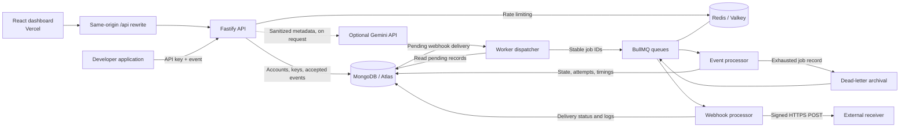

# EventForge

### Project-isolated event processing, asynchronous jobs, and delivery visibility.

EventForge is a developer platform for accepting events through an API, processing them asynchronously, and understanding what happens afterward. It combines a React dashboard with a Fastify API, MongoDB-backed event records, Redis/BullMQ queues, and independently retried webhook deliveries.

The focus is backend engineering: tenant boundaries, idempotent ingestion, durable dispatch, retry semantics, and observable job states. Optional AI suggestions help interpret sanitized failure metadata; they are not the processing engine or a substitute for diagnosis.

[Architecture](#architecture) · [Screenshots](#screenshots) · [Metrics](#metrics-and-observed-results) · [Local setup](#run-locally) · [Deployment](#deployment) · [Testing](#testing-and-ci)

## What it solves

Moving work outside an HTTP request introduces new questions: Was the event accepted? Did a client retry create a duplicate? Is the job waiting, running, or permanently failed? Did the downstream webhook succeed?

EventForge provides a shared workflow for answering those questions:

- **Decouple intake from execution.** Persist accepted events before processing them asynchronously.
- **Make client retries safe.** Project-scoped idempotency keys distinguish duplicate requests from conflicting payloads.
- **Recover from transient processing failures.** Retry with exponential backoff, then preserve exhausted jobs for inspection.
- **Separate delivery failures from processing failures.** A failing webhook does not rerun successful event processing.
- **Isolate project operations.** Scope API keys, jobs, metrics, and retry actions to an authenticated project owner.
- **Replace opaque background work with visible state.** Inspect attempts, durations, sanitized errors, and delivery history.

Example extension points include order notifications, application lifecycle events, integration tasks, and asynchronous workflows. The included processor is a **reference handler**: it accepts events and supports controlled failure simulation. It does not yet implement business-specific order, email, or payment processing.

## Core capabilities

| Area | Implemented behavior |
|---|---|
| Accounts | Registration, login, short-lived access JWTs, rotating refresh tokens, logout |
| Projects | Owner-scoped workspaces and project switching |
| API keys | Project-scoped keys, one-time secret display, hashed storage, revocation |
| Ingestion | Validated JSON through `POST /events` and `POST /api/events` |
| Idempotency | Compound unique index and canonical content digest |
| Queues | Redis-backed BullMQ queues with priorities from 1 to 10 |
| Recovery | Three processing attempts, exponential backoff, dead-letter archival, manual retry |
| Rate limits | Shared per-project event budget across its API keys; additional request limits |
| Dashboard | Status filtering, pagination, job inspection, 24-hour metrics, 10-second polling |
| Webhooks | Signed HTTPS delivery, independent retries, per-attempt delivery logs |
| AI assistance | Optional Gemini suggestions from allowlisted failure metadata |
| Tooling | Docker Compose, TypeScript checks, Vitest, GitHub Actions, Vercel proxy configuration |

Multi-tenancy is implemented as **owner-based project isolation**, not organization membership or team RBAC. There is no separate configurable quota for each individual key; keys belonging to a project share its ingestion budget.

## Architecture



### Component responsibilities

- **Frontend:** React + TypeScript + Tailwind, built with Vite. Calls the API through `/api`, keeps the access token in memory, and refreshes dashboard data every 10 seconds.
- **API:** Fastify validates requests, authenticates users and keys, enforces project ownership, stores events, and serves inspection and metrics endpoints.
- **MongoDB:** Stores users, sessions, projects, keys, event state, timing fields, and webhook delivery records. Event documents also act as durable pending-dispatch records.
- **Redis/BullMQ:** Provides queue coordination, priorities, backoff scheduling, and distributed rate-limit counters.
- **Worker:** Polls pending records, dispatches queue jobs, consumes event and webhook queues, and updates durable state.
- **AI provider:** Receives a small structured failure summary only when a user explicitly requests an explanation.

### Data model

| Collection | Responsibility |
|---|---|
| Users | Unique email and salted password hash |
| Sessions | Hashed refresh token, user reference, expiry with TTL index |
| Projects | Owner, project name, webhook configuration |
| API keys | Project reference, key hash, display prefix, revocation timestamp |
| Events | Payload, priority, idempotency digest, status, attempts, generation, dispatch flags, timings |
| Deliveries | Event/generation reference, delivery body, status, attempt logs, signing secret |

Important indexes include unique project/idempotency-key pairs for string keys, unique event/generation delivery pairs, and project/creation-time indexes for event retrieval.

## How an event moves through the system

1. A developer creates an account, a project, and an API key.
2. A client sends an event with `x-api-key` and, optionally, `idempotency-key`.
3. The API authenticates the key, applies the project rate limit, validates the body, and computes a canonical content digest.
4. MongoDB persists the event with a queued state. The API returns `202 Accepted`; this means **stored**, not **processed**.
5. The worker dispatcher finds pending events and enqueues them with a stable ID containing the event ID and retry generation.
6. A BullMQ worker records the running state and executes the reference processor.
7. Success records completion time, processing duration, and intake-to-completion latency. Failure schedules a retry or transitions to dead-letter state.
8. If a webhook was configured when the event was accepted, successful processing creates a durable delivery handoff. Delivery retries independently.
9. The dashboard retrieves current records and aggregates to display the outcome.

```text
queued → running → succeeded → optional webhook delivery
             │
             └→ retrying → running
                              │
                              └→ dead-letter → manual retry → queued
```

### Idempotency contract

| Request | Response |
|---|---|
| New idempotency key in a project | `202`, new event/job ID |
| Same key and normalized content in the same project | `200`, existing event/job ID, `duplicate: true` |
| Same key with different content | `409 Conflict` |
| No idempotency key | Independent event for every accepted request |

The digest includes the normalized event name, payload, and priority. Object key ordering is canonicalized. The database unique index protects concurrent duplicate requests; idempotency does not depend on an in-memory check.

### Reliability semantics

- **At-least-once, not exactly-once:** crashes around side effects or acknowledgments can cause repeated execution or delivery. Domain handlers and webhook receivers must be idempotent.
- **Durable handoff:** undispatched events remain in MongoDB if queue dispatch fails. Stable BullMQ IDs protect repeated enqueue attempts within an event generation.
- **Intake still depends on Redis:** rate limiting runs before the MongoDB insert, so a Redis outage can also delay or prevent new ingestion. Durable dispatch protects already-accepted work; it does not make the API Redis-independent.
- **Priorities:** 10 is the highest application priority; the worker maps it to BullMQ's positive-priority ordering. Priority does not preempt a job already running.
- **Automatic retries:** three total attempts, with default backoff delays of 1 second and 2 seconds. These are scheduling delays, not completion-time guarantees.
- **Dead-letter recovery:** permanently failed events are archived to a separate queue. Manual retry requires completed archival and increments a generation under the original event ID.
- **Independent webhook retries:** failed delivery does not change a successful event into a processing failure.
- **Shutdown:** signal handlers stop dispatching and close workers, queues, and database connections.
- **Known recovery boundary:** Redis data loss after dispatch is not fully rebuilt automatically from MongoDB. Queue restoration/reconciliation requires operational work.

## Technology stack

| Layer | Technologies |
|---|---|
| Frontend | React 18, TypeScript, Tailwind CSS 3, Vite 6 |
| Backend | Node.js 22, Fastify 5, Zod |
| Persistence | MongoDB 7 locally, MongoDB Atlas for hosted storage, Mongoose 8 |
| Queue/cache | Redis 7 locally, Render Valkey-compatible Key Value, BullMQ 5, ioredis |
| Authentication | Fastify JWT, Node.js crypto/scrypt, HTTP-only refresh cookies |
| Testing | Vitest 5, Fastify `app.inject()`, real MongoDB/Redis integration fixtures |
| Local infrastructure | Docker, Docker Compose |
| CI | GitHub Actions |
| Hosting | Vercel frontend, Render backend processes, MongoDB Atlas, Render Key Value |
| Optional AI | Gemini REST API |

Dependency ranges live in [package.json](package.json); exact resolved versions live in [package-lock.json](package-lock.json). Commit both files together when changing dependencies.

## Screenshots

The six captures below document the application on **7 September 2026**. They show a small demonstration dataset, not seeded benchmark results.

### Overview dashboard

Project-scoped counters, processing duration, latency, failure rate, and retry rate.


### Intake and processing states

Hourly intake, state distribution, and the recent-jobs table for the demonstrated project.


### Job management

Filterable job history with attempt count, recorded processing time, and inspection actions.


### API key management

Project keys expose only a display prefix after creation and can be revoked for subsequent requests.


### Webhook configuration

Configure a public HTTPS destination and inspect delivery history. This capture has no recorded deliveries and does not demonstrate successful external delivery.


### Event submission

Send JSON with a project API key, event name, priority, and optional idempotency key.


## Metrics and observed results

Metrics are computed from MongoDB events **received in the preceding 24 hours**, scoped to the selected project. Job listings are separate and cover all time.

| Metric | Definition |
|---|---|
| Events received | Count of persisted events in the window |
| Succeeded | Events in that cohort currently marked succeeded |
| Average processing | Mean recorded duration of the successful attempt for succeeded events |
| Average latency | Mean time from original intake to successful completion, including queue wait and retries |
| Failure rate | Current dead-letter events ÷ received events × 100 |
| Retry rate | Events with more than one cumulative processing attempt ÷ received events × 100 |
| Event intake | Accepted event counts grouped into UTC hourly buckets |
| Processing states | Queued, running, retrying, succeeded, and dead-letter counts |

These are current-state aggregates, not an immutable history of failures. A manual retry can change an event's state; latency still starts at original intake. Missing rates or successful timings display as `—`, while empty counts display zero. Processing duration is an application-level timer, not an isolated CPU benchmark.

### Recorded demo sample

Source: the overview and job screenshots above, captured on 7 September 2026.

| Observation | Displayed value |
|---|---|
| Events received | 1 |
| Succeeded | 1 |
| Processing attempts | 1 |
| Average processing | 292 ms |
| Average intake-to-success latency | 2,772 ms |
| Permanent failure rate | 0.00% |
| Retry rate | 0.00% |
| Queued / running / retrying / dead-letter | 0 / 0 / 0 / 0 |

**Sample size: one event.** This screenshot confirms only that sample's intake-to-success workflow. The separate local load test below provides repeated burst measurements; it does not measure hosted capacity, uptime, or an SLA.

### Reproducible load testing

An isolated [benchmark suite](benchmarks/README.md) now exercises real HTTP ingestion, MongoDB persistence, BullMQ processing, concurrent idempotency, retries, dead-letter archival, manual retry, project rate limits across keys, and account isolation. It creates its own disposable fixtures; no production seed data or credentials are required.

The default workload is a 20-event warm-up followed by three rounds of 500 unique events at client concurrency 10. Reports include accepted requests/second, observed completions/second, HTTP and end-to-end p50/p95/p99 latency, processing duration, response-status counts, and correctness checks. Numeric raw samples and environment metadata are retained for review.

### Verified local load-test results — 7 September 2026

**1,500/1,500 measured events accepted and successfully processed**, across three 500-event bursts. All eight additional correctness probes passed. The 20-event warm-up and deliberately failing reliability fixtures are excluded from the throughput table.

Evidence: [generated report](benchmarks/published/2026-09-07-local-m2/report.md) and [raw samples and configuration](benchmarks/published/2026-09-07-local-m2/report.json). The reported latency percentiles were independently recalculated from the raw samples and matched. The earlier blocked agent attempt is not included as a benchmark result.

| Round | Accepted / succeeded | Intake (accepted req/s) | Observed completions/s | HTTP p95 | End-to-end p95 | End-to-end p99 | Processing p95 |
|---|---|---|---|---|---|---|---|
| 1 | 500 / 500 | 496.77 | 65.47 | 32.58 ms | 5,363 ms | 5,368 ms | 4 ms |
| 2 | 500 / 500 | 403.80 | 65.33 | 56.71 ms | 5,106 ms | 5,120 ms | 6 ms |
| 3 | 500 / 500 | 711.64 | 71.99 | 31.45 ms | 5,036 ms | 5,050 ms | 3 ms |

**Test conditions:** local Docker on Apple M2, macOS arm64, 8 logical CPUs, 8 GiB host RAM; Docker reported 8 CPUs and approximately 3.83 GiB RAM. The load generator ran Node v24.19.0. Each round used 10 concurrent HTTP clients, worker concurrency 5, the reference handler, and payloads with 256 bytes of padding. API/project limits were raised to 100,000/minute only in the isolated benchmark. Request logging remained enabled. The run began at 00:52:49 IST on 7 September (19:22:49 UTC on 6 September).

The report records base commit `1783a928a091b2635fd480e8c6269e0a5c52aef5` **with uncommitted changes**; use its source/config SHA-256 and container image identifiers as additional provenance, not the base commit alone.

**Correctness verified by this run:** twenty simultaneous duplicate submissions produced one event; conflicting content returned 409; five transient failures succeeded on attempt two; five permanent failures exhausted three attempts and completed archival; manual retry preserved cumulative attempts; two keys shared a project quota (202, 202, 429); missing API-key authentication returned 401; and another account could not inspect the project (404). This is separate from the integration suite, whose execution output is not included in this report.

**Interpretation:** the API acknowledged these bursts at 403.80–711.64 accepted requests/s; observed completions were 65.33–71.99/s. HTTP p95 was 31.45–56.71 ms, while intake-to-success p95 was 5.04–5.36 seconds. Do not describe the intake rate as completed-job throughput or the HTTP latency as end-to-end latency. Queue wait and dispatch pacing matter: the dispatcher reads up to 100 pending events per cycle and schedules its next cycle after a 1-second delay plus dispatch work. This is a plausible contributor to the observed gap, not a profiled root cause.

**Limits:** these are short, warmed-up, closed-loop local bursts, not sustained cloud capacity tests. Observed completion rates include drain polling. Production rate limits differ, the handler performs little domain work, and no real webhook delivery, AI, uptime, crash recovery, or maximum capacity was measured. Zero unexpected errors in 1,500 events does not establish a long-term reliability guarantee.

### Viewing benchmark metrics

The dashboard's Overview shows per-project 24-hour counts, mean processing time, mean end-to-end latency, failure/retry rates, and state counts. It does **not** currently show requests/second or p50/p95/p99 distributions, and it cannot import a benchmark report. The exact burst metrics above are available in the retained report, not as dashboard cards.

The benchmark uses a separate local database and randomly generated account credentials that are deliberately not saved. Its records do not appear in the hosted Vercel account, and an existing application login will not reveal those project records. Do not copy fixtures into production merely to populate the dashboard.

To view **new manual test events** in a local dashboard against the benchmark API, keep the isolated stack running, stop any other Vite process on port 5173, and run:

```sh
API_PROXY_TARGET=http://127.0.0.1:3011 npm run dev:web
```

Leave `VITE_API_URL` unset. Open `http://localhost:5173` (the configured allowed origin), create a new local account/project/key, and send events. The overview polls every 10 seconds. This displays that new project's events, **not the original benchmark run**. Keep the exact burst percentiles in the report until a dedicated Benchmark Results view is implemented.

## Run locally

### Prerequisites

- Git.
- Docker Desktop or Docker Engine with Compose.
- Node.js 22.12+ within the Node 22 release line and npm when running application processes outside Docker.
- Ports 5173, 3001, 27017, and 6379 available locally.

### Option A: full Docker Compose stack

```sh
git clone https://github.com/abhikhurannah/EventForge.git
cd EventForge
docker compose up --build
```

Open **http://localhost:5173**. The API runs at **http://localhost:3001**.

Compose starts the frontend development server, API, worker, MongoDB, and Redis. Redis uses AOF and `noeviction`; local database ports are bound to loopback. Named volumes survive `docker compose down`. Adding `-v` removes those volumes and their data.

### Option B: application processes on your machine

```sh
docker compose up -d mongo redis
npm ci
```

Create a local, gitignored `.env` with development-only values:

```dotenv
MONGODB_URI=mongodb://127.0.0.1:27017/eventforge
REDIS_URL=redis://127.0.0.1:6379
JWT_SECRET=local-only-change-this-to-at-least-32-random-characters
WEB_ORIGIN=http://localhost:5173
PORT=3001
NODE_ENV=development
PROJECT_RATE_LIMIT=100
RETRY_DELAY_MS=1000
WORKER_CONCURRENCY=5
```

Then run:

```sh
npm run dev
```

The development command starts the API, worker, and Vite concurrently. Vite proxies `/api` to the local API. API and worker startup scripts load `.env` if present.

### First event

Create an account with a 12–128 character password, create a project, then create an API key. Copy the secret when it is shown; it is not retrievable later.

```sh
curl http://localhost:3001/events \
  -H 'Content-Type: application/json' \
  -H 'x-api-key: YOUR_PROJECT_API_KEY' \
  -H 'idempotency-key: order-123' \
  -d '{"name":"order.created","payload":{"orderId":"123"},"priority":8}'
```

Expected new-event response shape:

```json
{
  "eventId": "<generated-event-id>",
  "jobId": "<same-generated-event-id>",
  "status": "queued",
  "duplicate": false
}
```

Repeat the exact request to check deduplication. Change its payload while retaining the same idempotency key to check conflict handling.

For the hosted frontend proxy, use `https://YOUR-FRONTEND/api/events`. For a direct backend integration, use `https://YOUR-BACKEND/events`.

### Exercise failure behavior

| Payload | Expected reference-handler behavior |
|---|---|
| `{"orderId":"123"}` | Succeeds normally |
| `{"failUntilAttempt":1}` | Fails once, then succeeds on the second attempt |
| `{"simulateFailure":true}` | Exhausts three attempts and enters dead-letter state |

Use a new idempotency key for each distinct event. Inspect a terminal job and choose Retry after addressing its failure. A permanently failing simulation will fail again after manual retry.

## API reference

User-protected routes require `Authorization: Bearer <access-token>`. Ingestion requires `x-api-key`; the project is determined from the key, not a client-supplied project ID.

| Method | Path | Purpose |
|---|---|---|
| GET | `/api/health` | MongoDB/Redis connection readiness |
| POST | `/api/auth/register` | Create account and session |
| POST | `/api/auth/login` | Authenticate and create session |
| POST | `/api/auth/refresh` | Rotate refresh cookie and issue access JWT |
| POST | `/api/auth/logout` | Invalidate refresh session |
| GET / POST | `/api/projects` | List owned projects / create project |
| GET / POST | `/api/projects/:projectId/keys` | List / create project keys |
| DELETE | `/api/projects/:projectId/keys/:keyId` | Revoke key |
| POST | `/events` or `/api/events` | Accept event |
| GET | `/api/projects/:projectId/jobs` | List jobs; optional `status` and `page` |
| GET | `/api/projects/:projectId/jobs/:jobId` | Inspect one job |
| POST | `/api/projects/:projectId/jobs/:jobId/retry` | Retry archived terminal job |
| GET | `/api/projects/:projectId/metrics` | Retrieve 24-hour aggregates |
| PUT | `/api/projects/:projectId/webhook` | Configure or disable webhook |
| GET | `/api/projects/:projectId/deliveries` | Retrieve latest 100 delivery records |
| POST | `/api/projects/:projectId/jobs/:jobId/explain` | Request optional AI suggestion |

Job pages contain up to 25 records. Valid status filters are `queued`, `running`, `retrying`, `succeeded`, and `dead-letter`.

Event names are 2–100 characters and match `^[a-z][a-z0-9_.-]+$`. Payloads are JSON objects; priority is an integer from 1 to 10, defaulting to 5. Unknown top-level event fields are rejected. Request bodies are limited to 64 KiB.

Common responses include `401` for missing/invalid authentication, `403` for origin rejection, `404` for inaccessible resources, `409` for conflicts, `422` for validation failures, and `429` for rate limits.

## Authentication and security

- Passwords use salted scrypt and timing-safe comparison.
- Access JWTs expire after 15 minutes and are held in browser memory.
- Refresh tokens are random, hashed in MongoDB, expire after 30 days, and rotate atomically on use.
- Refresh cookies use `HttpOnly`, `SameSite=Strict`, and `Path=/api/auth`; production adds `Secure`.
- Mutating browser requests are checked against the exact configured origin. Refresh and logout require that origin.
- Project ownership is checked before exposing jobs, keys, metrics, configuration, retries, or AI suggestions.
- API key secrets are stored as hashes, shown once, and revocable.
- The default ingestion budget is 100 requests per project per 60-second counter window, shared across its keys. Duplicates and invalid event bodies also consume this budget after key authentication.
- Additional request limits include a default 120 requests/minute, 10/minute for registration/login, and 5/minute for AI explanations. Behind proxies, request-IP behavior needs deployment-specific review.
- Request logging redacts authorization, cookies, and API key headers. AI receives no raw payloads or free-form logs.

Keep credentials in local ignored files or provider secret settings. Never publish them in screenshots, README examples, frontend variables, or committed templates. Rotate any exposed credentials; deleting a current file does not erase Git history. These controls are not a claim of a completed security audit.

## Webhook delivery

Each project can configure one HTTPS endpoint. The event captures its webhook configuration at ingestion, so changing the project endpoint affects newly accepted events.

After successful processing, the delivery worker sends:

- `x-eventforge-id`: stable delivery record ID.
- `x-eventforge-timestamp`: Unix timestamp in seconds.
- `x-eventforge-signature`: hex HMAC-SHA256 of `timestamp + "." + rawBody`.

Receivers should verify the signature with the configured signing secret, reject stale timestamps, and deduplicate delivery IDs. The JSON body's `id` identifies the event; the header identifies the delivery.

Delivery supports three attempts with exponential backoff and a 10-second HTTP request timeout after DNS resolution. Logs record attempt, timestamp, HTTP status when available, and sanitized error code—not response bodies.

Destination validation permits public IPv4 HTTPS destinations on port 443, rejects embedded credentials and fragments, validates DNS answers, pins the checked address for the TLS request, and does not follow redirects. Localhost HTTP webhook receivers are intentionally unsupported.

## Optional AI failure explanations

Set `GEMINI_API_KEY` and `GEMINI_MODEL` on the API service to enable explanations. Choose a model available to your provider account.

The request contains only an allowlisted error code, job state, attempt count, and maximum attempts. Payloads, event names, URLs, credentials, identifiers, and raw logs are excluded. The provider call has a 15-second timeout.

Every response is labeled **“Suggestion—not root cause.”** Missing configuration or provider failure does not disable core event processing. An AI explanation is a debugging aid, not evidence that a root cause has been established.

## Configuration

| Variable | Used by | Purpose / default |
|---|---|---|
| `MONGODB_URI` | API + worker | Same MongoDB database; defaults to local `eventforge` |
| `REDIS_URL` | API + worker | Same Redis instance; defaults to localhost:6379 |
| `JWT_SECRET` | API | Required; at least 32 characters; use a random production secret |
| `WEB_ORIGIN` | API | Exact frontend origin; default `http://localhost:5173` |
| `PORT` | API | HTTP listener; default 3001; Render supplies its port |
| `NODE_ENV` | Application | Set `production` for hosted secure cookies |
| `PROJECT_RATE_LIMIT` | API | Shared project ingestion limit; default 100/minute |
| `REQUEST_RATE_LIMIT` | API | General request limit; default 120/minute; benchmark stack explicitly raises it |
| `RETRY_DELAY_MS` | Worker | Initial exponential backoff delay; default 1000 |
| `WORKER_CONCURRENCY` | Worker | Event concurrency; default 5; webhook concurrency is separately fixed at 5 |
| `QUEUE_PREFIX` | API + worker | Queue/rate-limit namespace; default `eventforge`; must match |
| `GEMINI_API_KEY` | API | Optional server-only provider secret |
| `GEMINI_MODEL` | API | Optional provider model identifier |
| `VITE_API_URL` | Frontend build | Leave unset for same-origin `/api` routing |
| `API_PROXY_TARGET` | Vite dev server | Local proxy target; default local API, Compose uses `http://api:3001` |

Generate a production signing secret locally with `openssl rand -hex 32`. Do not commit or paste its output publicly.

## Deployment

The documented hosted setup uses **Vercel for the frontend, Render for API/worker processes, MongoDB Atlas for persistence, and Render Key Value for BullMQ**. The screenshots show the deployed application's one-event workflow; they do not verify every feature or ongoing service availability.

The repository's [vercel.json](vercel.json) currently proxies API traffic to `https://eventforge-pmko.onrender.com`. Forks must substitute their own backend.

### 1. Provision MongoDB and Redis-compatible storage

Create an Atlas database user and configure network access for the backend. Store its connection string only on Render. URL-encode special characters in database passwords.

Place Render Key Value in the same region as the backend and use its internal connection URL. Use provider-supported persistence and a no-eviction policy for reliable queue operation. Both API and worker must use the same database, Redis endpoint, and queue prefix.

### 2. Run the backend

The Dockerfile uses Node 22 Alpine, installs locked dependencies, type-checks/builds the frontend, and defaults to `npm run start:api`.

For a **small free-tier demonstration**, run the real API and worker together in one Render Web Service using this Docker Command:

```sh
./node_modules/.bin/concurrently --kill-others "npm run start:api" "npm run start:worker"
```

Set backend environment variables from the table above, including `NODE_ENV=production`, a new `JWT_SECRET`, and the production `WEB_ORIGIN`. Set the health-check path to `/api/health`. Event concurrency can be reduced to 1 for a small demo.

For an **always-on deployment topology**, run separate services:

| Service | Startup command |
|---|---|
| API web service | `npm run start:api` |
| Background worker | `npm run start:worker` |

A worker-only process does not listen for HTTP requests and should not be configured as an HTTP Web Service.

### 3. Configure Vercel

Import the GitHub repository with:

| Setting | Value |
|---|---|
| Framework | Vite |
| Root directory | Repository root |
| Install command | `npm ci` |
| Build command | `npm run build` |
| Output directory | `dist` |
| Production branch | `main` |
| Frontend environment variables | None required for the proxy setup |

Configure the backend rewrite in the root `vercel.json`:

```json
{
  "buildCommand": "npm run build",
  "outputDirectory": "dist",
  "rewrites": [
    {
      "source": "/api/:path*",
      "destination": "https://YOUR-BACKEND.onrender.com/api/:path*"
    }
  ]
}
```

The [Vercel external rewrite](https://vercel.com/docs/routing/rewrites) keeps browser API calls on the frontend origin. Leave `VITE_API_URL` unset; pointing it directly at an unrelated backend domain conflicts with the current strict refresh-cookie design. Never expose database or signing secrets through `VITE_` variables.

After obtaining the stable Vercel production domain, set Render's `WEB_ORIGIN` to that exact HTTPS origin, without a trailing slash, and redeploy Render. Preview domains are different origins and are not automatically authorized.

Merge deployment changes into `main`. A successful feature-branch preview does not update production, and redeploying an old failed commit does not pick up later fixes.

### 4. Verify the deployment

1. Open the backend `/api/health`, then the same path through the frontend domain; expect `{"ok":true}`.
2. Register, refresh the page, and verify session renewal.
3. Create a project/key and submit an event; verify it reaches succeeded.
4. Repeat an idempotent request and verify the same event ID.
5. Submit controlled transient and permanent failures; verify retries and dead-letter behavior.
6. Configure a receiver you control and check signed delivery/retry logs.
7. Enable and separately test AI only if needed.

The health endpoint checks connection state; it is not a worker heartbeat or proof of successful processing.

### Free-tier limitations

Render Free Web Services sleep after 15 minutes without incoming traffic. With the combined topology, the worker sleeps too, so unattended jobs and webhooks can be delayed. Free Key Value is in-memory only and loses data on restart. Usage quotas and billing limits also apply. See [Render's free-service documentation](https://render.com/docs/free).

This configuration is a portfolio/demo deployment, not a production reliability guarantee. Always-on workers, persistent queues, backups, monitoring, and tested recovery procedures are prerequisites for stronger operational assurances.

## Testing and CI

```sh
npm ci
npm run lint
npm test
npm run build
```

The benchmark-tooling verification on 7 September 2026 recorded **28 unit tests passed**, **9 integration tests skipped**, successful TypeScript checks, and a successful production build. The six additional unit tests cover percentile calculations, missing/invalid measurements, workload bounds, and bounded concurrency. This is not a claim that integration tests or an end-to-end load test passed.

Run the integration suite against disposable local services:

```sh
docker compose up -d mongo redis
MONGODB_URI=mongodb://127.0.0.1:27017/eventforge_test REDIS_URL=redis://127.0.0.1:6379 npm run test:integration
```

| Suite | Coverage |
|---|---|
| Unit | Event validation, canonicalization, password hashing, safe errors, retry thresholds, webhook destination rules, HMAC signatures |
| Integration | Authentication/isolation, refresh replay, concurrent idempotency, unkeyed requests, rate limits, dispatch, retries, dead-letter/manual retry, key revocation, webhook retry separation |

Integration tests use Fastify injection, real MongoDB and BullMQ/Redis, and a stubbed outbound webhook sender. They require the `eventforge_test` database, isolate queue names with a test prefix, and clean test queues rather than flushing shared Redis. Use a dedicated test Redis instance, never production.

[GitHub Actions](.github/workflows/ci.yml) is configured for pushes and pull requests: locked install → TypeScript check → unit tests → integration tests with MongoDB/Redis services → web build. The `lint` script is TypeScript checking, not a separate ESLint ruleset.

## Troubleshooting

| Symptom | Check |
|---|---|
| `Origin not allowed` | Render `WEB_ORIGIN` must exactly match the website being used; save and redeploy |
| `npm ci` dependency mismatch | Regenerate the lock file for the intended dependency versions, test, and commit both dependency files |
| Preview Ready, production failing | Merge the fixed feature branch into `main`; check the deployment commit |
| `MongoServerError: bad auth` | Atlas database-user credentials, password encoding, database/auth settings, and saved Render URI |
| No open HTTP ports | A worker-only command is running as a web service; use the combined command or a background worker |
| Jobs remain queued | Worker startup, matching MongoDB/Redis/prefix, dispatch logs, free-service sleep, or queue data loss |
| `.env not found. Continuing without it.` | Expected on Render when configuration comes from service environment settings |
| Webhook rejected | Destination must resolve to public IPv4 and use HTTPS port 443 without redirects |
| AI unavailable | Both Gemini settings are required; core processing does not depend on them |

Do not disable origin validation or replace restricted settings with wildcards to work around authentication errors.

## Repository guide

```text
EventForge/
├── server/
│   ├── app.ts             # HTTP routes, auth, ownership, ingestion, metrics, AI
│   ├── core.ts            # Validation, hashing, safe errors, signatures
│   ├── db.ts              # MongoDB models and indexes
│   ├── redis.ts           # Connections, queue names, retry options
│   ├── processing.ts      # Dispatcher and event/delivery processors
│   ├── webhooks.ts        # Destination checks and signed HTTPS transport
│   ├── worker.ts          # Consumers, polling, shutdown
│   └── index.ts           # API bootstrap
├── web/
│   ├── main.tsx           # Dashboard and account UI
│   └── api.ts             # Requests, access token, refresh handling
├── public/                # Six product screenshots
├── tests/                 # Unit and opt-in integration suites
├── deploy/                # Example Vercel configuration
├── outputs/               # Setup notes, verification notes, demo script
├── .github/workflows/     # Continuous integration
├── compose.yaml           # Local five-service stack
├── Dockerfile             # Application container
├── vercel.json            # Frontend build and API rewrite
├── package.json
└── package-lock.json
```

## Scope and next steps

Implemented foundations are intentionally distinguished from future work:

- Add domain-specific event handlers and side-effect idempotency.
- Automate reconciliation after Redis data loss and define retention policies.
- Add team membership/RBAC and optional per-key quotas.
- Add worker heartbeats, alerting, tracing, and latency percentiles.
- Extend the recorded local burst test with sustained arrival-rate workloads and deployed-environment measurements before making capacity or reliability claims.
- Test backup restoration and always-on infrastructure failure scenarios.
- Record the 3–5 minute walkthrough using [the demo script](outputs/DEMO.md); no finished video is included.
- Complete a security review and remove/rotate any historically exposed credentials.

EventForge demonstrates a working event-processing foundation with explicit reliability boundaries—not an exactly-once system or a finished managed queue service.
